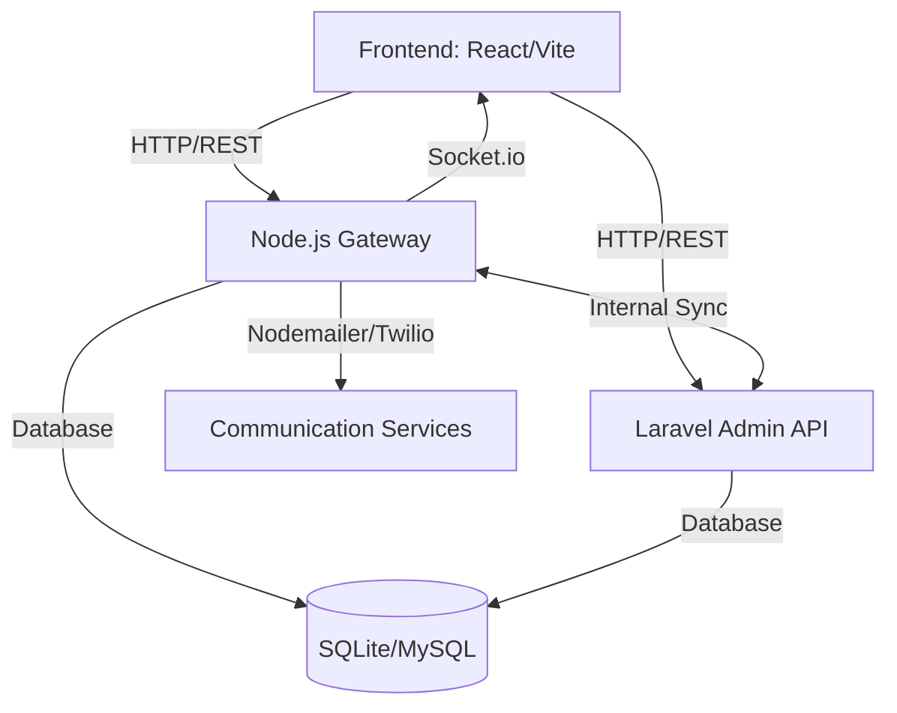

# 🛡️ SecureGate

### *Modern Resident & Visitor Management System*

[](https://react.dev/)
[](https://laravel.com/)
[](https://nodejs.org/)
[](https://vitejs.dev/)
[](LICENSE)

SecureGate is a high-performance, premium security management solution designed for gated communities, residential complexes, and enterprise facilities. It bridges the gap between security personnel, residents, and visitors through real-time notifications, video signaling, and a unified management dashboard.

---

## 🌟 Key Features

### 🏢 **For Administrators (Superadmin & Master Admin)**
- **Unified Dashboard**: Real-time analytics on visitor traffic and resident activity.
- **RBAC (Role-Based Access Control)**: Manage staff, security guards, and administrative permissions.
- **System Configuration**: Dynamic SMTP settings, announcement management, and system auditing.
- **Dynamic Data**: Support for both MySQL and SQLite for flexible deployment.

### 💂 **For Security Personnel**
- **Instant Visitor Registration**: Seamless check-in flow with automatic resident alerts.
- **Real-time Status Sync**: Instant feedback when a resident approves or denies a visitor via Socket.io.
- **Security Alerts**: Broadcast emergency alerts to all residents instantly.

### 🏠 **For Residents**
- **One-Tap Approval**: Approve or deny visitors directly from a mobile-friendly link.
- **Video Interaction**: Integrated WebRTC signaling for visitor verification. (Beta)
- **Email/WhatsApp Notifications**: Stay informed even when away from the app.

---

## 🚀 Tech Stack

| Layer | Technology |
|---|---|
| **Frontend** | React 19, Vite, Lucide Icons, Chart.js, Vanilla CSS / Tailwind |
| **Primary Backend** | Laravel 12 (PHP 8.2+) |
| **Real-time Gateway** | Node.js, Socket.io, Express |
| **Database** | MySQL / SQLite (Hybrid support) |
| **Communication** | Nodemailer (Email), Twilio (SMS/WhatsApp), WebRTC (Signal) |

---

## 🏗️ System Architecture



---

## ⚙️ Getting Started

### Prerequisites
- **Node.js** (v18+)
- **PHP** (v8.2+)
- **Composer** (v2+)
- **MySQL** (Optional, SQLite supported)

### Installation

1. **Clone the Repository**
   ```bash
   git clone https://github.com/vinith-kumar-vk/SecureGate.git
   cd SecureGate
   ```

2. **Backend Setup (Laravel)**
   ```bash
   cd laravel-backend
   composer install
   cp .env.example .env
   php artisan key:generate
   php artisan migrate
   ```

3. **Frontend & Gateway Setup (Node/React)**
   ```bash
   cd ..
   npm install
   # Create a .env in the root or server directory
   # Configure PORT=3001, EMAIL_USER, etc.
   ```

4. **Running the Application**
   - **Development**:
     ```bash
     # Terminal 1: Frontend (Vite)
     npm run dev

     # Terminal 2: Real-time Gateway
     npm run server

     # Terminal 3: Laravel API
     cd laravel-backend
     php artisan serve
     ```

---

## 📁 Directory Structure

- `src/`: React frontend source code (Pages, Components, Context).
- `laravel-backend/`: Main administrative API and dashboard controller.
- `server/`: Node.js real-time gateway and Socket.io signaling server.
- `public/`: Static assets for the frontend.
- `dist/`: Production build output.

---

## 📄 License

This project is licensed under the MIT License - see the [LICENSE](LICENSE) file for details.

---

<p align="center">
  Developed with ❤️ by the SecureGate Team
</p>
